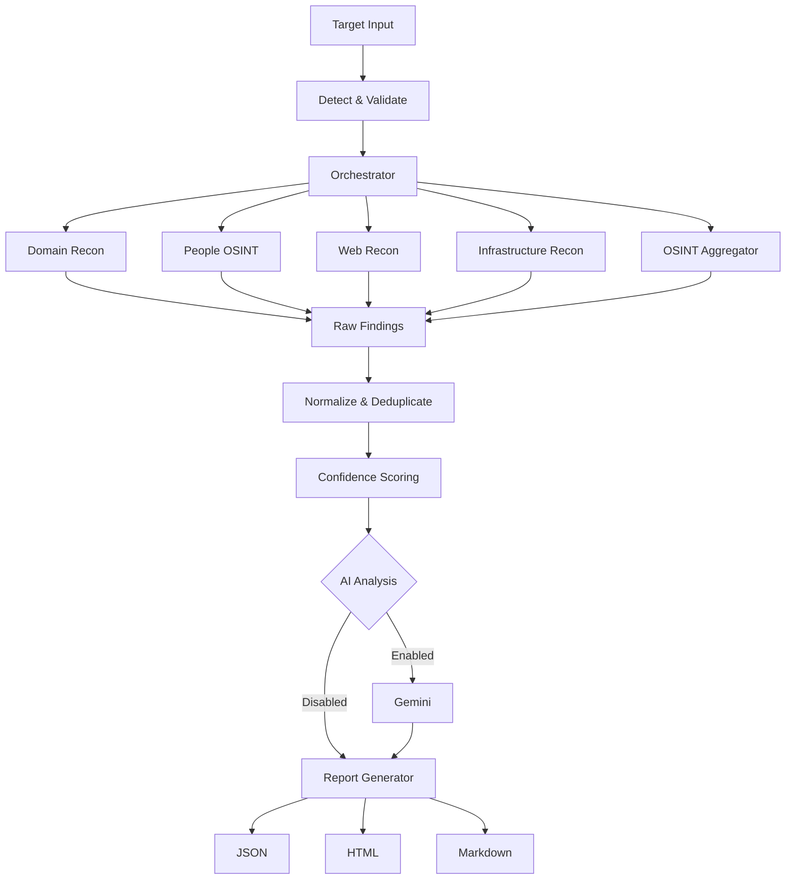

# GANDIV

<div align="center">

```text
 ██████╗  █████╗ ███╗   ██╗██████╗ ██╗██╗   ██╗
██╔════╝ ██╔══██╗████╗  ██║██╔══██╗██║██║   ██║
██║  ███╗███████║██╔██╗ ██║██║  ██║██║██║   ██║
██║   ██║██╔══██║██║╚██╗██║██║  ██║██║╚██╗ ██╔╝
╚██████╔╝██║  ██║██║ ╚████║██████╔╝██║ ╚████╔╝
 ╚═════╝ ╚═╝  ╚═╝╚═╝  ╚═══╝╚═════╝ ╚═╝  ╚═══╝
```

**Multi-Source OSINT Reconnaissance Engine**

*Never Miss Target Intelligence.*

</div>

---

## Overview

**GANDIV** is an open-source OSINT reconnaissance engine designed to automate the information-gathering phase of a security assessment.

It accepts targets such as domains, emails, phone numbers, usernames, IP addresses, URLs, and names, then routes them through the appropriate reconnaissance modules.

The collected findings are normalized, deduplicated, confidence-scored, optionally analyzed with Gemini, and exported as structured reports.

> **Collect signals. Correlate evidence. Reduce noise. Produce intelligence.**

---

## Workflow



---

## Features

- Multi-source OSINT reconnaissance
- Domain, web, and infrastructure reconnaissance
- Email and phone OSINT
- Username and person enumeration
- Finding normalization and deduplication
- Confidence scoring
- Optional Gemini-powered analysis
- JSON, HTML, and Markdown reporting
- Interactive menu and CLI
- Concurrent scanning
- Resumable scans

---

## Installation

Clone the repository and install the dependencies:

```bash
git clone https://github.com/CalculusGuy/GANDIV.git
cd GANDIV
pip install -r requirements.txt
cp .env.example .env
```

Start the interactive interface:

```bash
python main.py
```

---

## User Guide

### Interactive Mode

Run:

```bash
python main.py
```

Available modules:

| Option | Module | Purpose |
|:---:|---|---|
| `1` | People OSINT | Email, phone, username, and name |
| `2` | Domain Recon | Subdomains, DNS, WHOIS, certificates |
| `3` | Web Recon | Technology, WAF, headers, JavaScript |
| `4` | Infrastructure Recon | IP, ASN, Shodan, Censys, SSL |
| `5` | Breach & Leak Check | HIBP and paste sources |
| `6` | Username Enumeration | Multi-platform enumeration |
| `7` | Reverse Image Search | Image and EXIF analysis |
| `8` | Full OSINT | Run available modules |
| `9` | Custom Scan | Select modules manually |

---

## CLI Usage

### Domain Recon

```bash
python main.py scan --target example.com --type domain --full
```

### Email OSINT

```bash
python main.py scan --target user@example.com --type people-email
```

### Phone OSINT

```bash
python main.py scan --target +919999999999 --type people-phone
```

### Username Enumeration

```bash
python main.py scan --target johndoe --type people-username
```

### Full OSINT Scan

```bash
python main.py scan --target example.com --full --report json,html,markdown
```

### Resume a Scan

```bash
python main.py resume --checkpoint path/to/checkpoint.json
```

### Check Environment

```bash
python main.py check
```

### Configure API Keys

```bash
python main.py config-wizard
```

---

## Reports

Reports are generated inside `gandiv_reports/`.

| Format | Purpose |
|---|---|
| JSON | Automation, CI/CD, dashboards, and tooling |
| HTML | Human review and presentations |
| Markdown | Documentation and security writeups |

---

## API Integrations

API keys are optional. Additional integrations can increase coverage.

| Service | Purpose |
|---|---|
| Gemini | AI analysis |
| HIBP | Breach exposure |
| Shodan | Open-port intelligence |
| Censys | Infrastructure intelligence |
| GitHub | Code and search intelligence |
| VirusTotal | Domain/IP reputation |
| Numverify | Phone validation |

Configure available keys through:

```bash
python main.py config-wizard
```

For Gemini, the `.env` entry is:

```text
GEMINI_API_KEY=your_key_here
```

---

## Architecture

```text
Target
  │
  ▼
Detection & Validation
  │
  ▼
Orchestrator
  │
  ├── Domain Recon
  ├── People OSINT
  ├── Web Recon
  ├── Infrastructure Recon
  └── OSINT Aggregator
  │
  ▼
Normalize + Deduplicate
  │
  ▼
Confidence Scoring
  │
  ├── Gemini Analysis (Optional)
  │
  ▼
Report Generator
  │
  ├── JSON
  ├── HTML
  └── Markdown
```

---

## Project Structure

```text
GANDIV/
├── main.py
├── requirements.txt
├── README.md
├── EXAMPLES.md
├── LICENSE
├── .env.example
├── .gitignore
│
├── gandiv/
│   ├── config.py
│   ├── models.py
│   ├── logger.py
│   ├── menu.py
│   ├── orchestrator.py
│   ├── normalizer.py
│   ├── llm_analyzer.py
│   │
│   ├── modules/
│   │   ├── domain_recon.py
│   │   ├── web_recon.py
│   │   ├── infra_recon.py
│   │   ├── email_recon.py
│   │   ├── email_osint.py
│   │   ├── phone_osint.py
│   │   ├── person_recon.py
│   │   ├── osint_aggregator.py
│   │   ├── breach_osint.py
│   │   ├── username_osint.py
│   │   ├── name_osint.py
│   │   └── image_osint.py
│   │
│   ├── reporters/
│   │   ├── json_reporter.py
│   │   ├── html_reporter.py
│   │   └── markdown_reporter.py
│   │
│   └── utils/
│       ├── http_client.py
│       └── validators.py
│
└── tests/
    └── test_modules.py
```

---

## Responsible Use

GANDIV is intended for **authorized security research and defensive intelligence**.

Only use GANDIV against systems or targets you own or have explicit authorization to assess.

Do not use it to:

- Scan systems without authorization
- Conduct surveillance on individuals
- Circumvent security controls
- Violate privacy or data-protection laws

GANDIV collects information from publicly accessible sources and does not bypass authentication or access private systems.

---

## Tech Stack

| Component | Technology |
|---|---|
| Language | Python 3.11+ |
| Async | asyncio, aiohttp |
| Concurrency | ThreadPoolExecutor |
| CLI | Typer, Rich |
| HTTP | requests, aiohttp |
| DNS | dnspython |
| WHOIS | python-whois |
| AI | Gemini |
| Reporting | Jinja2, JSON, Markdown |
| Testing | pytest |

---

## Creator

**Nilanjan Chowdhury**

Cybersecurity Researcher · Ethical Hacker · Builder of SUDARSHAN & BRAMHASTRA

- GitHub: [@CalculusGuy](https://github.com/CalculusGuy)
- Medium: [@nilanjan.calculus](https://medium.com/@nilanjan.calculus)
- Portfolio: [calculusguy.github.io](https://calculusguy.github.io)

**GANDIV is created and developed by Nilanjan Chowdhury.**

---

## License

MIT License. See [LICENSE](LICENSE).

---

<div align="center">

**GANDIV**

*Reconnaissance, not surveillance.*

*Never Miss Target Intelligence.*

</div>
